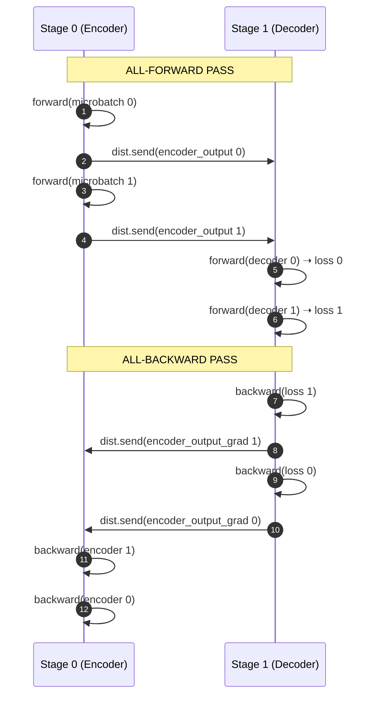
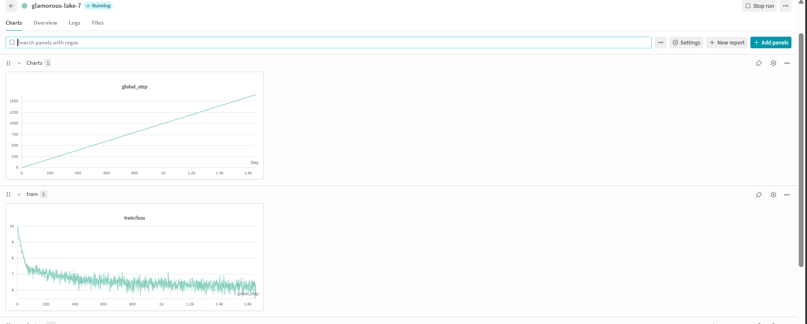

# Distributed 3D Transformer

A from-scratch English-to-Italian Transformer (~90M parameters) trained
with **native PyTorch 3D parallelism** — Tensor Parallelism, Pipeline
Parallelism, and Data Parallelism — running concurrently across 8 GPUs on
4 nodes on Microsoft Azure. Every layer of the distributed system is
implemented without Megatron, DeepSpeed, or any high-level training framework.
Raw PyTorch APIs only.

---

## The Problem

Scaling transformer training beyond a single GPU exposes three independent
bottlenecks that cannot be solved by the same strategy:

**1. Intra-layer memory pressure.**
As model width grows, individual weight matrices (attention projections, FFN
layers) become too large for a single GPU's HBM. A 90M-parameter model with
`d_model=512` and 6 layers is modest today — but the same parallelism
primitives apply directly to billion-parameter models where this bottleneck is
absolute. The only solution is to shard the weight tensor itself across GPUs
within a node, with each GPU computing a column- or row-wise partition and
contributing a partial result to an all-reduce. This is **Tensor Parallelism**.

**2. Inter-layer pipeline depth.**
Once each layer is too large for one node, the model must be partitioned
vertically — different layers on different machines. For a transformer, the
natural split is the encoder-decoder boundary. Stage 0 computes encoder
representations; Stage 1 consumes them to compute decoder outputs and loss.
Activations travel forward over the network; gradients travel back. This is
**Pipeline Parallelism**.

**3. Data throughput.**
A single TP+PP pipeline is still memory-bound to its own data shard. To
increase effective batch size and amortize the communication cost of the
pipeline, the entire TP+PP stack is replicated across independent clusters.
Each cluster sees a non-overlapping shard of training data. After every
backward pass, gradients are all-reduced across clusters so all replicas
converge on the same model. This is **Data Parallelism**.

None of these three strategies subsumes the others. They compose
multiplicatively: `TP × PP × DP = total GPUs`. All three must be active
simultaneously to fully utilize a multi-node GPU cluster.

```
  How the three dimensions decompose the problem:

  ┌─────────────────────────────────────────────────────────────────────┐
  │                     Single Training Step                           │
  │                                                                     │
  │  DP=2  ──── replicates the entire pipeline across 2 clusters        │
  │           ┌─────────────────┐     ┌─────────────────┐             │
  │           │   Cluster 0     │     │   Cluster 1     │             │
  │           │  (data shard 0) │     │  (data shard 1) │             │
  │           │                 │     │                 │             │
  │  PP=2 ──── splits model     │     │  splits model   │             │
  │           │  ┌───────────┐  │     │  ┌───────────┐  │             │
  │           │  │  Stage 0  │  │     │  │  Stage 0  │  │             │
  │           │  │ (Encoder) │  │     │  │ (Encoder) │  │             │
  │           │  └─────┬─────┘  │     │  └─────┬─────┘  │             │
  │           │        │ send   │     │        │ send   │             │
  │           │  ┌─────▼─────┐  │     │  ┌─────▼─────┐  │             │
  │           │  │  Stage 1  │  │     │  │  Stage 1  │  │             │
  │           │  │ (Decoder) │  │     │  │ (Decoder) │  │             │
  │           │  └───────────┘  │     │  └───────────┘  │             │
  │           └─────────────────┘     └─────────────────┘             │
  │                    │  DDP all-reduce gradients  │                  │
  │                    └────────────────────────────┘                  │
  │                                                                     │
  │  TP=2 ──── shards each stage's layers across 2 GPUs within node    │
  │           Stage N: [ GPU 0 (cols 0..255) | GPU 1 (cols 256..511) ] │
  │                          all-reduce partial results                 │
  └─────────────────────────────────────────────────────────────────────┘
```

---

## The Transformer

A standard encoder-decoder architecture implemented entirely in `model.py`:

- **Embedding + Positional Encoding** — learned embeddings summed with sinusoidal
  position encodings for both source and target sequences
- **Encoder** — `N` layers of multi-head self-attention + position-wise FFN
  with residual connections and layer normalization
- **Decoder** — `N` layers of masked multi-head self-attention, cross-attention
  over encoder output, and position-wise FFN
- **Projection Layer** — linear + softmax over target vocabulary for next-token
  logits

The model has no dependency on `transformers` or any external architecture
library. Every `nn.Module` subclass is written from scratch, which is a
prerequisite for applying tensor parallelism — the weight tensors must be
directly accessible for sharding via `parallelize_module`.

Trained on `Helsinki-NLP/opus_books` (English → Italian), a parallel corpus
with ~32K sentence pairs per split.

```
  Encoder-Decoder Transformer (model.py)

  Source sentence (EN)                Target sentence (IT)
        │                                    │
  ┌─────▼──────┐                      ┌──────▼──────┐
  │ src_embed  │                      │ tgt_embed   │
  │  + src_pos │                      │  + tgt_pos  │
  └─────┬──────┘                      └──────┬───────┘
        │                                    │
  ┌─────▼──────────────────┐          ┌──────▼────────────────────┐
  │        Encoder         │          │         Decoder           │
  │  ┌──────────────────┐  │          │  ┌─────────────────────┐  │
  │  │  Self-Attention  │  │          │  │  Masked Self-Attn   │  │
  │  │  (×N layers)     │  │          │  │  (×N layers)        │  │
  │  ├──────────────────┤  │          │  ├─────────────────────┤  │
  │  │  Feed Forward    │  │          │  │  Cross-Attention    │◀─────── encoder_output
  │  │  + LayerNorm     │  │          │  │  (over enc output)  │  │
  │  │  + Residual      │  │          │  ├─────────────────────┤  │
  │  └──────────────────┘  │          │  │  Feed Forward       │  │
  └─────────┬──────────────┘          │  │  + LayerNorm        │  │
            │                         │  │  + Residual         │  │
       encoder_output                 │  └─────────────────────┘  │
  (batch, seq_len, d_model)           └──────────┬─────────────────┘
            │                                    │
            └──────────────────────────►  ┌──────▼──────┐
                   [dist.send/recv]        │  Projection │
                  across PP boundary       │  + Softmax  │
                                           └──────┬───────┘
                                                  │
                                            logits → loss
```

---

## Architecture

### 3D Parallelism — All Three Dimensions Active Simultaneously

#### Tensor Parallelism (TP=2, intra-node)

Each node runs 2 GPUs. Within a node, the attention and FFN layers are
column/row-wise sharded across the 2 GPUs using PyTorch's native
`ColwiseParallel` and `RowwiseParallel` wrappers from
`torch.distributed.tensor.parallel`. Each GPU holds half the weight matrix and
computes half the output. A single all-reduce fuses the partial results.

```python
parallelize_module(stage, tp_mesh, {
    "attention.w_q": ColwiseParallel(),
    "attention.w_k": ColwiseParallel(),
    "attention.w_v": ColwiseParallel(),
    "attention.w_o": RowwiseParallel(),
    "feed_forward.linear_1": ColwiseParallel(),
    "feed_forward.linear_2": RowwiseParallel(),
})
```

No manual tensor slicing. The mesh-aware parallel API handles the sharding,
collectives, and gradient accumulation automatically.

#### Pipeline Parallelism (PP=2, inter-node)

The transformer is split at the encoder-decoder boundary. Every node belongs
to one of two pipeline stages:

- **Stage 0 (PP=0):** `src_embed → src_pos → Encoder` — produces
  `encoder_output` of shape `(batch, seq_len, d_model)`
- **Stage 1 (PP=1):** `tgt_embed → tgt_pos → Decoder → ProjectionLayer` —
  consumes `encoder_output`, produces logits and computes cross-entropy loss

Communication between stages is explicit point-to-point:

```python
# Stage 0 — forward
dist.send(encoder_output.contiguous(), group=pp_group, dst=peer_rank)

# Stage 1 — forward
dist.recv(encoder_output, group=pp_group, src=peer_rank)

# Stage 1 — backward
dist.send(grad, group=pp_group, dst=peer_rank)

# Stage 0 — backward
dist.recv(grad, group=pp_group, src=peer_rank)
```

`peer_rank` is resolved as a global rank via
`dist.get_global_rank(pp_group, peer_local_rank)` — not a hardcoded offset —
so the same pipeline code works regardless of how the DP clusters are laid out
across global rank space.

The schedule is **AFAB (All-Forward-All-Backward)**: all micro-batches run
forward through the full pipeline before any backward pass begins. Chosen
deliberately over 1F1B for transparency and debuggability during development.



#### Data Parallelism (DP=2, inter-cluster)

The entire TP+PP pipeline is replicated twice — two independent clusters
processing non-overlapping data shards. Each pipeline stage is wrapped in
`DistributedDataParallel` with the DP process group:

```python
stage = DDP(stage, device_ids=[local_rank], process_group=dp_mesh.get_group())
```

DDP hooks fire after every backward pass, all-reducing gradients across the
two clusters. The `DistributedSampler` is constructed with `dp_rank` and
`dp_size` — not global rank — so each cluster samples a distinct partition of
the dataset regardless of world size.

---

### 3D Topology

| Dimension | Size | Role | Communication |
|-----------|------|------|---------------|
| TP | 2 | Shard attention + FFN weight matrices within a node | All-reduce over `tp_mesh` |
| PP | 2 | Encoder on Stage 0 nodes, decoder on Stage 1 nodes | P2P `dist.send` / `dist.recv` over `pp_mesh` |
| DP | 2 | Two full TP+PP pipelines on different data shards | Gradient all-reduce via DDP over `dp_mesh` |

**Total: 8 GPUs across 4 nodes** (`TP=2 × PP=2 × DP=2`)

### 8-GPU Rank Layout

```
 ╔══════════════════════════════════════════════════════════════════════════╗
 ║                     Azure  —  4 × NC16as_T4_v3                         ║
 ╠══════════════════════════╦═══════════════════════════════════════════════╣
 ║    CLUSTER 0  (DP = 0)   ║          CLUSTER 1  (DP = 1)                ║
 ╠══════════════════════════╬═══════════════════════════════════════════════╣
 ║  Node 0  (PP = 0)        ║  Node 2  (PP = 0)                           ║
 ║  <node0-private-ip>       ║  <node2-private-ip>                         ║
 ║  Encoder stage            ║  Encoder stage                              ║
 ║  ┌─────────┬──────────┐  ║  ┌─────────┬──────────┐                    ║
 ║  │ Rank 0  │ Rank 1   │  ║  │ Rank 4  │ Rank 5   │                    ║
 ║  │ TP=0    │ TP=1     │  ║  │ TP=0    │ TP=1     │                    ║
 ║  │ T4 GPU0 │ T4 GPU1  │  ║  │ T4 GPU0 │ T4 GPU1  │                    ║
 ║  └────┬────┴────┬─────┘  ║  └────┬────┴────┬─────┘                    ║
 ║       │TP all-reduce│    ║       │TP all-reduce│                       ║
 ║       ╔══════════╗       ║       ╔══════════╗                          ║
 ║       ║ PP send  ║       ║       ║ PP send  ║                          ║
 ║       ║ encoder_ ║       ║       ║ encoder_ ║                          ║
 ║       ║ output   ║       ║       ║ output   ║                          ║
 ║       ╚══════════╝       ║       ╚══════════╝                          ║
 ║  Node 1  (PP = 1)        ║  Node 3  (PP = 1)                           ║
 ║  <node1-private-ip>       ║  <node3-private-ip>                         ║
 ║  Decoder stage            ║  Decoder stage                              ║
 ║  ┌─────────┬──────────┐  ║  ┌─────────┬──────────┐                    ║
 ║  │ Rank 2  │ Rank 3   │  ║  │ Rank 6  │ Rank 7   │                    ║
 ║  │ TP=0    │ TP=1     │  ║  │ TP=0    │ TP=1     │                    ║
 ║  │ T4 GPU0 │ T4 GPU1  │  ║  │ T4 GPU0 │ T4 GPU1  │                    ║
 ║  └─────────┴──────────┘  ║  └─────────┴──────────┘                    ║
 ╠══════════════════════════╩═══════════════════════════════════════════════╣
 ║          DDP all-reduce gradients across DP=0 ↔ DP=1 after backward    ║
 ╚══════════════════════════════════════════════════════════════════════════╝
```

Each rank occupies a unique `(dp, pp, tp)` cell in the mesh. The DP dimension
is the outermost axis — ranks 0-3 form one DP replica, ranks 4-7 form the
other. Within each DP replica, the PP dimension separates encoder from decoder
nodes; within each node, the TP dimension shards layers across GPUs.

---

### DeviceMesh — The Coordinate System

The entire topology is encoded in a single call:

```python
mesh = init_device_mesh(
    device_type,                        # "cuda"
    (dp_size, pp_size, tp_size),        # (2, 2, 2)
    mesh_dim_names=("dp", "pp", "tp")
)
```

`init_device_mesh` constructs all process groups automatically from this shape.
No `dist.new_group()`, no manual rank list construction, no topology-specific
branching in training code. Every rank's role is derived purely from its
position in the mesh:

```python
pp_mesh   = mesh["pp"]                        # PP process group
tp_mesh   = mesh["tp"]                        # TP process group
dp_mesh   = mesh["dp"]                        # DP process group

pp_rank   = pp_mesh.get_local_rank()          # 0 = encoder, 1 = decoder
tp_rank   = tp_mesh.get_local_rank()          # 0 or 1 within the node
dp_rank   = dp_mesh.get_local_rank()          # 0 or 1 cluster identity
pp_group  = pp_mesh.get_group()               # ProcessGroup for P2P comms
```

**Mesh Coordinate to Global Rank Mapping:**

| Global Rank | `(DP, PP, TP)` | Physical Location | Pipeline Stage |
|:---:|:---:|:---|:---|
| **0** | `(0, 0, 0)` | Node 0, GPU 0 | Encoder (Cluster 0) |
| **1** | `(0, 0, 1)` | Node 0, GPU 1 | Encoder (Cluster 0) |
| **2** | `(0, 1, 0)` | Node 1, GPU 0 | Decoder (Cluster 0) |
| **3** | `(0, 1, 1)` | Node 1, GPU 1 | Decoder (Cluster 0) |
| **4** | `(1, 0, 0)` | Node 2, GPU 0 | Encoder (Cluster 1) |
| **5** | `(1, 0, 1)` | Node 2, GPU 1 | Encoder (Cluster 1) |
| **6** | `(1, 1, 0)` | Node 3, GPU 0 | Decoder (Cluster 1) |
| **7** | `(1, 1, 1)` | Node 3, GPU 1 | Decoder (Cluster 1) |

This is why the architecture is topology-agnostic. Changing `TP_SIZE`,
`PP_SIZE`, or `DP_SIZE` via environment variables reshapes the mesh and
every downstream process group without touching training logic.

---

### End-to-End Training Step

```
  Data flow for one global step  (NUM_MICROBATCHES = 2)

  CLUSTER 0 (DP=0)                              CLUSTER 1 (DP=1)
  ─────────────────────────────────             ─────────────────────────────

  DataLoader shard 0                            DataLoader shard 1
  [mb0, mb1] = _chunk_batch(batch)              [mb0, mb1] = _chunk_batch(batch)
       │                                               │
  ┌────▼────────────────────────────┐           ┌─────▼───────────────────────────┐
  │  ALL-FORWARD PASS               │           │  ALL-FORWARD PASS               │
  │                                 │           │                                 │
  │  Node 0 (Encoder, PP=0)         │           │  Node 2 (Encoder, PP=0)         │
  │   mb0 ──► Encoder ──► enc_out0  │           │   mb0 ──► Encoder ──► enc_out0  │
  │   mb1 ──► Encoder ──► enc_out1  │           │   mb1 ──► Encoder ──► enc_out1  │
  │                │ dist.send ───► │           │                │ dist.send ───► │
  │  Node 1 (Decoder, PP=1)         │           │  Node 3 (Decoder, PP=1)         │
  │   enc_out0 + mb0 ──► Decoder    │           │   enc_out0 + mb0 ──► Decoder    │
  │            ──► loss0            │           │            ──► loss0            │
  │   enc_out1 + mb1 ──► Decoder    │           │   enc_out1 + mb1 ──► Decoder    │
  │            ──► loss1            │           │            ──► loss1            │
  │                                 │           │                                 │
  │  ALL-BACKWARD PASS              │           │  ALL-BACKWARD PASS              │
  │                                 │           │                                 │
  │  Node 1: backward(loss1)        │           │  Node 3: backward(loss1)        │
  │          backward(loss0)        │           │          backward(loss0)        │
  │          dist.send(grad) ─────► │           │          dist.send(grad) ─────► │
  │  Node 0: recv grad              │           │  Node 2: recv grad              │
  │          backward through enc   │           │          backward through enc   │
  └─────────────────────────────────┘           └─────────────────────────────────┘
           │                                               │
           └───────────────── DDP all-reduce ──────────────┘
                        (gradients averaged across
                         DP=0 and DP=1 clusters)
                                    │
                              optimizer.step()
                                    │
                        dcp.save() ──► /mnt/training-data
```

Within each node, the TP all-reduce happens transparently inside the
`ColwiseParallel` / `RowwiseParallel` wrappers during every forward and
backward — not shown above to keep the diagram readable.

1. Batch is split into `NUM_MICROBATCHES` micro-batches via `_chunk_batch`.
2. **All-Forward**: Stage 0 encodes each micro-batch and sends
   `encoder_output` to Stage 1. Stage 1 runs decoder + projection + loss.
   Both stages accumulate activations for backward.
3. **All-Backward**: Stage 1 backpropagates, sends `encoder_output.grad` to
   Stage 0. Stage 0 backpropagates through the encoder using the received
   gradient.
4. **DP sync**: DDP all-reduces gradients across the two clusters.
5. **Optimizer step**: Both clusters update identical parameters.
6. **Checkpoint**: DCP saves sharded model state to Azure Files.

---

## Cloud Run — Microsoft Azure

### Infrastructure

**Steps to provision the cluster:**

1. Create a **Resource Group** in your preferred Azure region.
2. Create a **Virtual Network** with a private subnet (e.g. a `/24` block). All
   4 nodes must reside in the same subnet so NCCL can reach every peer over
   the private NIC without NAT.
3. Create a **Storage Account** and add a **File Share** under it. This share
   will be mounted on every node at a common path (e.g. `/mnt/training-data`)
   via CIFS over `/etc/fstab` so it persists across reboots. All DCP
   checkpoints from all ranks land here.
4. Create **4 × NC16as_T4_v3** VMs — Ubuntu Server 22.04 LTS, Spot pricing
   recommended. Attach each to the VNet subnet created above.
   - Disable **Secure Boot** (Azure portal → VM → Configuration) before
     installing NVIDIA drivers; DKMS kernel modules are unsigned and will not
     load with Secure Boot active.
5. Open **port 48123** (or your chosen `--master_port`) bidirectionally across
   all node pairs in the Network Security Group.
6. On each node: install `nvidia-driver-535`, create a Python venv, install
   `torch==2.2.0+cu121 numpy<2` and the rest of `requirements.txt`, clone
   this repo, and mount the Azure Files share.
7. Populate `/etc/hosts` on every node with the private IPs of all peers so
   hostnames resolve without a DNS dependency.

**Example layout** (names and IPs are illustrative — use whatever your
deployment assigns):

```
Resource Group:   <your-rg>  (<region>)
Virtual Network:  <your-vnet>  (private subnet, e.g. 10.0.0.0/24)
Storage Account:  <your-storage-account>
  File Share:     <your-file-share>  →  mounted at /mnt/training-data on all nodes

VMs (×4):  NC16as_T4_v3  —  16 vCPUs, 110 GB RAM, 2× Tesla T4 (16 GB each)
           Ubuntu Server 22.04 LTS, Spot pricing
           PyTorch 2.2.0+cu121, CUDA 12.1, Driver 535

  node0  →  <node0-private-ip>   PP=0, DP=0  (Encoder, Cluster 0)
  node1  →  <node1-private-ip>   PP=1, DP=0  (Decoder, Cluster 0)
  node2  →  <node2-private-ip>   PP=0, DP=1  (Encoder, Cluster 1)
  node3  →  <node3-private-ip>   PP=1, DP=1  (Decoder, Cluster 1)
```

All 4 nodes share the same VNet subnet. NCCL transport uses the private NIC
(`NCCL_SOCKET_IFNAME=eth0`). InfiniBand is disabled (`NCCL_IB_DISABLE=1`)
since T4 VMs use TCP/IP transport.

The Azure Files share is mounted on each node at boot via `/etc/fstab` using
CIFS. Checkpoint writes from all 4 nodes go to the same share — DCP handles
sharded writes so no two ranks write to the same file.

### Launch Commands

Set `MASTER_ADDR` to the **private IP of node 0** (the rendezvous node).
Run the following on all 4 nodes simultaneously, varying only `--node_rank`:

```bash
# Replace <node0-private-ip> with the actual private IP of your node 0
TP_SIZE=2 PP_SIZE=2 DP_SIZE=2 \
NUM_EPOCHS=3 NUM_MICROBATCHES=2 \
MODEL_FOLDER=/mnt/training-data/weights \
MASTER_ADDR=<node0-private-ip> \
NCCL_SOCKET_IFNAME=eth0 \
NCCL_IB_DISABLE=1 \
TORCH_NCCL_ASYNC_ERROR_HANDLING=1 \
torchrun --nnodes=4 --nproc_per_node=2 \
         --master_addr=<node0-private-ip> --master_port=48123 \
         --node_rank=<0|1|2|3> \
         train_3d.py
```

`--nproc_per_node=2` spawns one worker per GPU per node, giving world size 8.
The topology resolves to `TP=2 × PP=2 × DP=2 = 8` and the mesh is built
automatically.

### Startup Summary (logged on rank 0)

```
========================================================================
3D training startup summary
backend=nccl | world_size=8 | local_world_size=2 | multi_node=True
requested topology=TP=2 PP=2 DP=2 | resolved topology=TP=2 PP=2 DP=2
batch_size=8 | num_microbatches=2 | preload=latest
checkpoint_dir=/mnt/training-data/weights
MASTER_ADDR=<node0-private-ip> | MASTER_PORT=48123
NCCL_SOCKET_IFNAME=eth0 | NCCL_IB_DISABLE=1
========================================================================
```

### What the Cloud Run Validated

- **Rendezvous** — all 8 ranks joined the process group across 4 nodes via
  `torchrun`'s elastic rendezvous on port 48123
- **NCCL multi-node transport** — collectives traversing the private VNet
  between all 4 nodes without timeout or transport errors
- **Tensor parallel all-reduces** — `ColwiseParallel` / `RowwiseParallel`
  correctly accumulating partial attention and FFN results within each node
- **Pipeline P2P communication** — `dist.send/recv` routing encoder activations
  and gradients across the PP stage boundary, correctly scoped to each DP
  cluster's PP process group
- **DP gradient sync** — DDP all-reducing gradients across both clusters after
  every backward; verified via `DEBUG_DP_SYNC=1` gradient diff check
- **Shared checkpoint storage** — DCP `FileSystemWriter` saving sharded model
  state across all 8 ranks to a single Azure Files share; `FileSystemReader`
  reloading correctly on resume
- **Full epoch completion** — 1819/1819 steps per epoch with loss decreasing
  monotonically across epochs; W&B run tracked at project
  `pytorch-transformer`

### Run Screenshots

**W&B — `train/loss` over the first epoch (1819 steps)**



Loss opens at ~10 (random-weight cross-entropy over a ~16K vocabulary) and
descends to ~7 within the first 200 steps, then continues decreasing
monotonically. The run was tracked under project `pytorch-transformer`,
W&B run name `wobbly-moon-8`.

---

### Bugs Encountered and Fixed During the Cloud Run

Every issue below surfaced during the actual multi-node execution — not
pre-diagnosed in local simulation.

| Issue | Root cause | Fix applied |
|-------|-----------|-------------|
| `TypeError: send() got unexpected argument 'group_dst'` | `group_dst`/`group_src` kwargs only exist in PyTorch nightly; not in stable 2.2 | Changed to standard `dst=` / `src=` positional kwargs in `pipeline.py` |
| PP deadlock — Stage 0 sending, Stage 1 not receiving | `peer_rank` was local PP rank (0 or 1), not global rank; `dist.send(dst=1)` on DP=1 nodes sent to global rank 1 (wrong cluster) | Added `peer_rank = dist.get_global_rank(pp_group, peer_local_rank)` in `pipeline.py` |
| `TypeError: save() got unexpected argument 'checkpoint_id'` | DCP API changed between PyTorch versions; `checkpoint_id` removed in 2.2 | Switched to `dcp.save(..., storage_writer=dcp.FileSystemWriter(path))` and matching reader |
| `device_count() = 0` / `CUDA initialization` warning | PyTorch 2.12 ships with CUDA 13.0 stubs; Azure driver was 12.2, below the minimum | Pinned `torch==2.2.0+cu121` — compatible with CUDA driver ≥ 12.1 |
| NVIDIA driver not loading after install on 2 of 4 nodes | Azure "Trusted Launch" VMs have Secure Boot enabled by default; NVIDIA DKMS kernel modules are unsigned | Disabled Secure Boot in Azure portal → VM → Configuration before driver installation |
| NumPy 2.x ABI incompatibility with PyTorch C extensions | Default pip resolution pulled NumPy 2.2; PyTorch 2.2 extensions were compiled against NumPy 1.x ABI | Pinned `numpy<2` in the virtual environment |

---

## Key Design Decisions

**Why AFAB over 1F1B?**
The 1F1B (one-forward-one-backward) schedule reduces pipeline bubble fraction
but complicates the gradient accumulation logic significantly — especially when
combined with DDP hooks that fire at the end of the full backward pass, not per
micro-batch. AFAB keeps the pipeline schedule orthogonal to DDP, making the
interaction between PP and DP gradients straightforward to reason about.

**Why explicit `dist.send/recv` over `torch.distributed.pipeline_sync`?**
Direct P2P gives full control over what is sent, when, and on which process
group. It also makes `DEBUG_PP=1` trivial to implement — every send and recv
logs the rank, micro-batch index, and tensor shape. A higher-level pipeline API
would obscure exactly the communication behavior that needed to be debugged.

**Why `DDP(process_group=dp_mesh.get_group())` over FSDP?**
At 90M parameters, FSDP's per-layer all-gather/reduce-scatter overhead is
larger than the memory savings. DDP with the DP process group is the correct
primitive here: it all-reduces gradients across exactly the DP dimension and
nothing else, leaving PP and TP communication unaffected.

**Why environment-variable-driven topology?**
The same `train_3d.py` runs in single-GPU smoke mode (`torchrun --standalone
--nproc_per_node=1`), in 8-rank local CPU simulation, and in the full 8-GPU
cloud run. No code changes between modes — just `TP_SIZE`, `PP_SIZE`, `DP_SIZE`
and `torchrun` arguments. The mesh validates `world_size == TP × PP × DP` and
falls back to `(1, 1, 1)` if they don't match, making local development safe.

---

## Debug Hooks

| Environment variable | Effect |
|---------------------|--------|
| `DEBUG_PP=1` | Prints `[PP Rank R \| MB M] Sending/Receiving encoder_output to/from peer P` on every pipeline boundary crossing. Reveals send/recv mismatches immediately. |
| `DEBUG_DP_SYNC=1` | After step 0, prints the max absolute gradient difference across DP replicas for every named parameter. Zero means the all-reduce is working. |
| Startup summary | Always printed on global rank 0: backend, world size, resolved topology, checkpoint dir, MASTER_ADDR, NCCL flags. |

---

## Repository Layout

```
train_3d.py        Main entry point — DeviceMesh init, model split, TP/PP/DP
                   wiring, AFAB training loop, DCP checkpoint save/load,
                   startup summary, W&B logging

pipeline.py        Pipeline stage module wrappers (EncoderStage, DecoderStage),
                   AFAB forward/backward schedule, micro-batch chunking,
                   all point-to-point dist.send/recv calls

model.py           Full transformer from scratch — MultiHeadAttentionBlock,
                   FeedForwardBlock, ResidualConnection, EncoderBlock,
                   DecoderBlock, Encoder, Decoder, ProjectionLayer,
                   build_transformer factory

dataset.py         BilingualDataset, tokenizer building via WordLevel,
                   causal_mask, collation

config.py          Hyperparameters, topology defaults (TP/PP/DP via env vars),
                   get_weights_file_path, latest_weights_file_path

run_cloud_node.sh  Per-node launch wrapper — sets NCCL env vars and calls
                   torchrun with the correct --node_rank

cloud.md           Full Azure deployment runbook: resource provisioning,
                   networking, storage mounting, preflight checks, launch
                   sequence, failure triage

tests/             Local simulation and correctness scripts:
  simulate_full_training_step.py   8-rank CPU emulation of full 3D step
  verify_3d_robustness.py          TP/PP/DP comm correctness under torchrun
  verify_tp_correctness.py         Tensor parallel weight sharding checks
  test_device_mesh.py              DeviceMesh rank coordinate verification
  run_linux_smoke.sh               Single-GPU WSL/Linux smoke test
```

---

## Local Validation

Before the cloud run, three levels of local validation passed:

```bash
# Level 1 — single GPU, full forward/backward, no distributed ops
bash tests/run_linux_smoke.sh

# Level 2 — 8-rank CPU emulation of full 3D logic (TP/PP/DP collectives via gloo)
python tests/simulate_full_training_step.py

# Level 3 — full 8-rank torchrun on a single machine, NCCL over loopback
USE_LIBUV=0 torchrun --standalone --nproc_per_node=8 tests/verify_3d_robustness.py
```

Level 3 catches rank assignment bugs, wrong process groups, and barrier
mismatches before any cloud spend. The PP deadlock bug (`peer_rank` using local
rank instead of global rank) surfaced only in the actual multi-node run because
local simulation uses contiguous global ranks where the two happen to coincide.

---

## Dependencies

```
torch>=2.2.0           # init_device_mesh, ColwiseParallel/RowwiseParallel,
                       # DTensor, DCP FileSystemWriter/Reader
datasets==2.15.0       # Pinned — avoids repo-id compatibility break in >=2.16
huggingface-hub==0.23.0
tokenizers>=0.13.3
torchmetrics>=1.0.3
tqdm>=4.65.0
wandb>=0.15.9
numpy<2                # PyTorch 2.2 C extensions require NumPy 1.x ABI
```

---

## Local Usage

### Single-GPU smoke test

```bash
bash tests/run_linux_smoke.sh
```

### 8-rank local 3D simulation

```bash
python tests/simulate_full_training_step.py
USE_LIBUV=0 torchrun --standalone --nproc_per_node=8 tests/verify_3d_robustness.py
```
